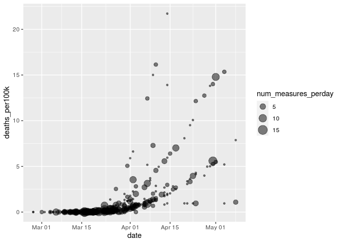

COVID Project
================
Team Delta
2020-10-20

  - [EAMON EDA](#eamon-eda)

``` r
filename_data <- "../data/combined_data.csv"
df_data <- read_csv(filename_data)
```

    ## Warning: Missing column names filled in: 'X1' [1]

    ## Parsed with column specification:
    ## cols(
    ##   X1 = col_double(),
    ##   state = col_character(),
    ##   date = col_date(format = ""),
    ##   total_cases = col_double(),
    ##   total_deaths = col_double(),
    ##   total_population = col_double(),
    ##   cases_per100k = col_double(),
    ##   deaths_per100k = col_double(),
    ##   measures = col_character(),
    ##   `Resource allocation` = col_double(),
    ##   `Risk communication` = col_double(),
    ##   `Social distancing` = col_double(),
    ##   `Healthcare and public health capacity` = col_double(),
    ##   `Travel restriction` = col_double(),
    ##   `Case identification, contact tracing and related measures` = col_double(),
    ##   `Returning to normal life` = col_double(),
    ##   `Environmental measures` = col_logical(),
    ##   num_measures_perday = col_double()
    ## )

``` r
df_data
```

    ## # A tibble: 11,994 x 18
    ##       X1 state date       total_cases total_deaths total_population
    ##    <dbl> <chr> <date>           <dbl>        <dbl>            <dbl>
    ##  1     1 Alab… 2020-03-13           6            0          4864680
    ##  2     2 Alab… 2020-03-14          12            0          4864680
    ##  3     3 Alab… 2020-03-15          23            0          4864680
    ##  4     4 Alab… 2020-03-16          29            0          4864680
    ##  5     5 Alab… 2020-03-17          39            0          4864680
    ##  6     6 Alab… 2020-03-18          51            0          4864680
    ##  7     7 Alab… 2020-03-19          78            0          4864680
    ##  8     8 Alab… 2020-03-20         106            0          4864680
    ##  9     9 Alab… 2020-03-21         131            0          4864680
    ## 10    10 Alab… 2020-03-22         157            0          4864680
    ## # … with 11,984 more rows, and 12 more variables: cases_per100k <dbl>,
    ## #   deaths_per100k <dbl>, measures <chr>, `Resource allocation` <dbl>, `Risk
    ## #   communication` <dbl>, `Social distancing` <dbl>, `Healthcare and public
    ## #   health capacity` <dbl>, `Travel restriction` <dbl>, `Case identification,
    ## #   contact tracing and related measures` <dbl>, `Returning to normal
    ## #   life` <dbl>, `Environmental measures` <lgl>, num_measures_perday <dbl>

# EAMON EDA

**Goal**: Try comparing numbers of cases / deaths at day of measure
implemented for all states.

``` r
df_data %>%
  drop_na(num_measures_perday) %>%
  ggplot(aes(date, total_cases)) +
  geom_point(aes(size = num_measures_perday), alpha=0.5)
```

<!-- -->

``` r
df_data %>%
  drop_na(num_measures_perday) %>%
  ggplot(aes(date, total_deaths)) +
  geom_point(aes(size = num_measures_perday), alpha=0.5)
```

<!-- -->

**Observations**:

  - Generally clustered around low amounts of low cases / deaths
      - Follows the observation that most measures were early on in the
        pandemic
  - Some outliers
      - A couple clear exponential (?) lines coming out of the main
        cluster.
          - Expect each line to be a single state, would be interesting
            if it is. Would also show a correlation between cases and
            measures, although this could likely be attributed to cases
            increasing over time, and these states specifically
            consistently giving out measures. (Not like measures are
            increasing in count of anything)
      - Also a single flat line coming out of the cluster, which is
        likely a state not hit hard but still releasing measures?
        Potentially interesting.
  - Seems the most dense mid / late March to April, might be worth
    looking into straight distribution over time?
  - Deaths seem a bit more clustered than cases - might be be indicative
    of deaths being a greater driver of decisions?

**Goal**: Sanity check - plot normalized cases and deaths

``` r
df_data %>%
  drop_na(num_measures_perday) %>%
  ggplot(aes(date, cases_per100k)) +
  geom_point(aes(size = num_measures_perday), alpha=0.5)
```

<!-- -->

``` r
df_data %>%
  drop_na(num_measures_perday) %>%
  ggplot(aes(date, deaths_per100k)) +
  geom_point(aes(size = num_measures_perday), alpha=0.5)
```

<!-- -->

**Observations**:

  - Death is no longer “more clustered” than cases.
  - No states with no cases or deaths past a certain point.
  - See a clear bottom line in terms of cases / deaths
      - However, no real relation between this line and the measures, so
        likely just showing covid spreading

**Goal**: Validate whether or not each line is a state.

``` r
df_data %>%
  drop_na(num_measures_perday) %>%
  ggplot(aes(date, cases_per100k)) +
  geom_point(aes(size = num_measures_perday, color=state))
```

<!-- -->

``` r
df_data %>%
  drop_na(num_measures_perday) %>%
  ggplot(aes(date, deaths_per100k)) +
  geom_point(aes(size = num_measures_perday, color=state))
```

<!-- -->

**Observations**:

  - Yes, each line corresponds to a state.

**Goal**: Plot distribution of measures over time

``` r
df_data %>%
  drop_na(num_measures_perday) %>%
  ggplot(aes(date, num_measures_perday)) +
  geom_col()
```

<!-- -->

**Observations**:

  - Shows a clear cluster of measures around mid March, distribution
    seems about normal with a tail to the right.

**Goal**: Check if interventions are made in response to the recent
number of cases

``` r
slideMean <- function(x, windowsize=3, slide=1){
 idx1 <- seq(1,length(x),by=slide);
 idx1 + windowsize -> idx2;
 idx2[idx2 > (length(x) + 1)] <- length(x) + 1;
 c(0, cumsum(x)) -> cx;
 ((cx[idx2] - cx[idx1]) / windowsize) -> cum_avg
 c(rep(0, windowsize - 1), cum_avg[1:(length(cum_avg) - windowsize + 1)]) -> trim_avg
 return(trim_avg);
}

window_size = 14
df_data %>%
  group_by(state) %>%
  mutate(avg_cases = slideMean(cases_per100k, window_size)) %>%
  slice(window_size:n()) %>%
  ungroup() %>%
  drop_na(num_measures_perday) %>%
  ggplot(aes(avg_cases, num_measures_perday)) +
  geom_point()
```

<!-- -->

**Observations**:

  - Possibly a weak negative relationship between avg cases number of
    measures? So, the more average cases there are, the less measures
    there are.
      - Seems likely in the case that we have more average cases later
        in the pandemic, and more average cases earlier in the pandemic
      - Seems like somehow accounting for the increase in cases over the
        course of the pandemic is important - maybe normalize by the
        total so far?

**Goal**: Plot average cases over time and measures over time to get a
sense of how they match up.

``` r
# slideMean(head(df_data, 20) %>% pull(cases_per100k), windowsize=14)
# head(df_data) %>% pull(cases_per100k)

window_size = 7
df_data %>%
  filter(date < "2020-7-1") %>%
  group_by(state) %>%
  mutate(avg_cases = slideMean(cases_per100k, windowsize=window_size)) %>%
  ungroup() %>%
  ggplot(aes(date, avg_cases)) +
  geom_point() +
  geom_col(aes(date, num_measures_perday * 5)) +
  scale_y_continuous(sec.axis = sec_axis(~./25, name="Num measures"))
```

    ## Warning: Removed 5823 rows containing missing values (position_stack).

<!-- -->

``` r
df_data %>%
  filter(date < "2020-7-1") %>%
  group_by(state) %>%
  mutate(avg_cases = slideMean(cases_per100k, windowsize=window_size)) %>%
  ungroup() %>%
  ggplot(aes(date, avg_cases)) +
  geom_smooth() +
  geom_col(aes(date, num_measures_perday * 5)) +
  scale_y_continuous(sec.axis = sec_axis(~./25, name="Num measures"))
```

    ## `geom_smooth()` using method = 'gam' and formula 'y ~ s(x, bs = "cs")'

    ## Warning: Removed 5823 rows containing missing values (position_stack).

<!-- -->

``` r
df_data %>%
  filter(date < "2020-7-1") %>%
  group_by(state) %>%
  mutate(avg_cases = slideMean(cases_per100k, windowsize=window_size)) %>%
  ungroup() %>%
  group_by(date) %>%
  mutate(avg_avg_cases = mean(avg_cases)) %>%
  ggplot(aes(date, avg_avg_cases)) +
  geom_col(aes(date, num_measures_perday * 5), color = "blue", fill = "blue") +
  geom_smooth(color = "black") +
  scale_y_continuous(
    name = "Average of Rolling Average for each State",
    sec.axis = sec_axis(~./25, name="Num measures")
  ) +
  scale_x_date(name = "Date") +
  theme(
      axis.title.y = element_text(color = "black"),
      axis.title.y.right = element_text(color = "blue")
  )
```

    ## `geom_smooth()` using method = 'gam' and formula 'y ~ s(x, bs = "cs")'

    ## Warning: Removed 5823 rows containing missing values (position_stack).

<!-- -->

**Observations**:

  - Seems like a majority of the measures were taken right before the
    cases spiked, which would mean most of the cases would have very low
    average cases.
  - Generally bad new for this direction. If most of the measures are
    made right before cases spike, then theres really not much info to
    look at.

**Goal**: Plot just cases over time vs measures and see how they match
up

``` r
df_data %>%
  filter(date < "2020-7-1") %>%
  group_by(date) %>%
  summarise(
    avg_total_cases = mean(cases_per100k),
    total_measures = sum(num_measures_perday, na.rm = TRUE) * 5
  ) %>%
  ungroup() %>%
  ggplot(aes(date, avg_total_cases)) +
  geom_col(aes(date, total_measures), color = "blue", fill = "blue") +
  geom_point(color = "black") +
  scale_y_continuous(
    name = "Average Total Cases",
    sec.axis = sec_axis(~./5, name="Num Measures")
  ) +
  scale_x_date(name = "Date") +
  theme(
      axis.title.y = element_text(color = "black"),
      axis.title.y.right = element_text(color = "blue")
  )
```

    ## `summarise()` ungrouping output (override with `.groups` argument)

<!-- -->

``` r
df_total_measures <-
  df_data %>%
  filter(date < "2020-7-1") %>%
  group_by(date) %>%
  summarise(
    avg_total_cases = mean(cases_per100k),
    total_measures = sum(num_measures_perday, na.rm = TRUE) * 10
  ) %>%
  ungroup()
```

    ## `summarise()` ungrouping output (override with `.groups` argument)

``` r
df_data %>%
  filter(date < "2020-7-1") %>%
  group_by(state, date) %>%
  ungroup() %>%
  ggplot(aes(date, cases_per100k, color = state)) +
  geom_col(
    data = df_total_measures,
    aes(y = total_measures), color = "black", fill = "black") +
  geom_point() +
  scale_y_continuous(
    name = "Average Cases",
    sec.axis = sec_axis(~./10, name="Num Measures")
  ) +
  scale_x_date(name = "Date") +
  theme(
      axis.title.y = element_text(color = "black"),
      axis.title.y.right = element_text(color = "black"),
      legend.position="none"
  )
```

<!-- -->

**Observations**:

  - Issue persists even when not looking at averages. Not good, means
    there is very little pre-measure data to pull trends from.
