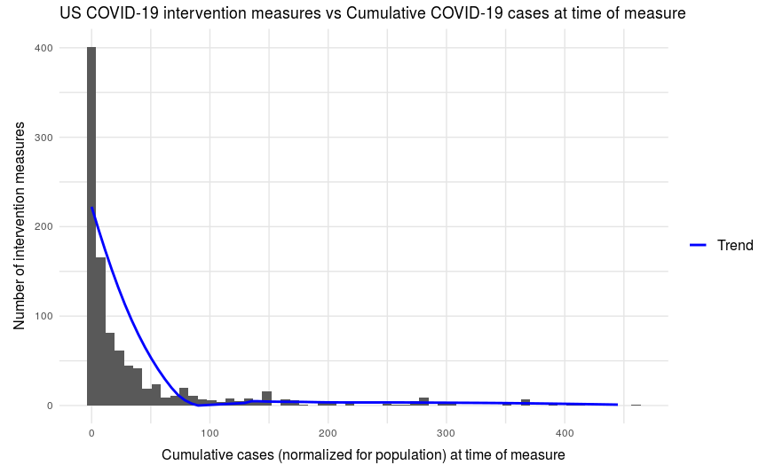

COVID-19 Final Report
================
Lilo Heinrich, Eamon Ito-Fisher, Alison Palmer, and Tim Novak
2020-10-26

# Central Question

<!-- -------------------------------------------------- -->

At the start of the pandemic, when did state governments implement
policies in relation to the amount COVID cases?

# Background Information

<!-- -------------------------------------------------- -->

SARS-CoV-2 also known colloquially as COVID-19 is a respiratory pathogen
that was discovered in 2019 in China
([WHO](https://www.who.int/emergencies/diseases/novel-coronavirus-2019/question-and-answers-hub/q-a-detail/coronavirus-disease-covid-19)).
COVID affects each person who is infected differently. The most common
symptoms of COVID-19 are fever, dry cough, and fatigue. Typically people
who have COVID experience mild symptoms or no symptoms, also known as
asymptomatic
carriers([CDC](https://www.cdc.gov/coronavirus/2019-ncov/hcp/clinical-guidance-management-patients.html)).
More severe cases of COVID can result in death and complications. The
WHO estimates that 80% of those with COVID recover without needing
hospitalization. 14% require hospitalization due to serious symptoms and
would be classified as a severe case, and 5% require intensive care in a
hospital and are classified as critical
cases([WHO](https://www.who.int/emergencies/diseases/novel-coronavirus-2019/question-and-answers-hub/q-a-detail/coronavirus-disease-covid-19)).

The WHO recommends social distancing, mask wearing, washing your hands,
covering coughs and sneezes, avoiding crows, and ventilating rooms or
socializing outside
([WHO](https://www.who.int/emergencies/diseases/novel-coronavirus-2019/question-and-answers-hub/q-a-detail/coronavirus-disease-covid-19)).

The median incubation period for COVID from the time of exposure to
symptoms is 4-5 days. For those who get sick enough to go to the ICU,
the median time from symptoms to admission is 10 to 12 days. Patients
who survived after being hospitalized, stayed in the hospital for a
median length of 10 to 13
days([CDC](https://www.cdc.gov/coronavirus/2019-ncov/hcp/clinical-guidance-management-patients.html)).

The government issued various declarations of emergency which led to
various travel
restrictions([Wikipedia](https://en.wikipedia.org/wiki/U.S._federal_government_response_to_the_COVID-19_pandemic#Containment_efforts_within_the_U.S.)).
The Federal government issued recommendations for state governments to
enact
([NPR](https://www.npr.org/2020/03/30/822448199/how-15-days-became-45-trump-extends-guidelines-to-slow-coronavirus)).
By not issuing a unifying policy for the entire country, each state was
able to enact policies they saw fit. This has led to a patchwork of
various COVID policies across the nation. An economic stimulus package
known as the CARES Act passed which gave qualifying Americans a one time
$1200 check to offset the lost revenue/salaries due to COVID-19’s impact
on the American economy. It included an extra $600 a week for
individuals collecting unemployment benefits. This bill also provided
loans for small businesses and larger businesses. $150 billion was set
aside for state and local governments and $130 billion for hospitals.
Congress also provided $3 billion to research and development of
treatments and vaccines related to COVID-19. The Paycheck Protection
Program provided $75 billion for hospitals to implement a nationwide
testing strategy
([Wikipedia](https://en.wikipedia.org/wiki/U.S._federal_government_response_to_the_COVID-19_pandemic#Containment_efforts_within_the_U.S.)).
In some states, the National Guard was deployed to provide medical
relief ([ABC
News](https://abcnews.go.com/US/coronavirus-live-updates-us-now-highest-globally-covid/story?id=69733219)).

# Data

<!-- -------------------------------------------------- -->

*[New York Times Coronavirus (Covid-19) Data in the United
States](https://github.com/nytimes/covid-19-data)*

The New York Times is releasing cumulative counts of coronavirus cases
in the United States, at both the state and county level, over time.
They are compiling this data from state and local governments and health
departments to attempt to provide a complete record of the ongoing
outbreak. Their dataset includes cumulative cases and cumulative deaths,
per day, per geographic region.

*[US Census Population
Data](https://data.census.gov/cedsci/table?q=United%20States&t=Population%20Total&g=0100000US.050000&tid=ACSDT5Y2018.B01003&hidePreview=false)*

In order to normalize coronavirus cases by population, we obtained
population data from the [US Census Bureau](https://data.census.gov). We
took the [5-Year Estimate of US Total Population by County
in 2018](https://data.census.gov/cedsci/table?q=United%20States&t=Population%20Total&g=0100000US.050000&tid=ACSDT5Y2018.B01003&hidePreview=false)
and aggregated to get the total state population. To join the
coronavirus data with the population data, we used the Federal
Information Processing Standards (FIPS) county code included in both
datasets.

*[Complexity Science Hub (CSH) Covid-19 Control Strategies
List](https://github.com/amel-github/covid19-interventionmeasures)*

Researchers at the Complexity Science Hub Vienna have compiled data on
government non-pharmaceutical intervention measures by country. For the
United States, they have also broken down the data by state.

This data was compiled from a wide range of public sources, including
“official government sources, peer-reviewed and non-peer-reviewed
scientific papers, webpages of public health institutions (WHO, CDC, and
ECDC), press releases, newspaper articles, and government communication
through social media.” Each measure taken is described within a 4-level
classification system, with increasing specificity at each level. This
dataset only includes information from February 27th to May 8th.

# Analysis

<!-- -------------------------------------------------- -->

Examining our intervention measures dataset, the earliest measures were
put in place on February 27th and the latest on May 8th, so we filtered
on this date range in our continuing analysis.

To investigate whether legislations were being made based off of current
covid data, we graphed normalized cumulative covid cases and number of
intervention measures over time. We hypothesized that if measures were
implemented in a reactionary sense we could see a spike or increase in
covid cases or deaths right before a policy change was implemented. We
noticed that this did not seem to be the case as there were no
significant features which occurred before implementation of policies.

We wanted to make this relation more clear and so we developed a metric
to measure the correlation between an increase in cases leading up to a
policy change and the number of interventions implemented. The metric we
chose to measure this was the average change in cases (for the 14 days
leading up to a policy change because of the 14 day maximum asymptomatic
transmission period of the COV19 virus). If more interventions were
implemented with a low average change in cases leading into them this
would suggest that the policies were largely preemptive in nature, while
policies would be more reactive in nature if the policies were
implemented following a high average change in cases.

A graph of this relationship in the data can be seen below:

We can see that most of the measures are implemented when there are low
changes in cases. Our understanding of the situation can be supplemented
by looking at our next graph.

 

Here, we look at the number of
normalized total cases a state had at the time of implementing a
measure. We see that most policies were made when there were low total
cases, and fewer policies were implemented where there were higher total
cases.

# Conclusion

<!-- -------------------------------------------------- -->

Measures taken by individual state governments tended to be more
pre-emptive than reactive. Looking at our two final graphs we can
clearly see that the majority of measures were made with a small number
of cases, and a small average change in cases. One thing to note here is
that the majority of the measures had low average change in cases, but
no average change in cases. These observations would suggest that
many of the measures were made when cases were still low and were just
starting to increase, which in turn would suggest that the measures were
made near the beginning of the pandemic right as it started. In all, it
seems like most measures near the start of the pandemic were made
preemptively, before the pandemic got too widespread.

# Additional Questions

<!-- -------------------------------------------------- -->

  - What are the outliers that had a high change in cases or high number
    of total cases before measures were implemented? Were they reactions
    to specific events?
  - In other countries that have slowed the spread more than America,
    are there specific policies that show up repeatedly? In addition,
    was the timing of their response earlier in relation to the cases?
  - What factors affect the spread of COVID other than policy?
  - Did US States take measures following COVID related events outside
    of the United States?

# Project Repo

<!-- -------------------------------------------------- -->

<https://github.com/Data-Science-Team-Delta/COVID-Project>

# Sources

<!-- -------------------------------------------------- -->

  - <https://www.cdc.gov/coronavirus/2019-ncov/hcp/clinical-guidance-management-patients.html>
  - <https://www.who.int/emergencies/diseases/novel-coronavirus-2019/question-and-answers-hub/q-a-detail/coronavirus-disease-covid-19>
  - <https://en.wikipedia.org/wiki/U.S._federal_government_response_to_the_COVID-19_pandemic#Containment_efforts_within_the_U.S>.
  - <https://www.npr.org/2020/03/30/822448199/how-15-days-became-45-trump-extends-guidelines-to-slow-coronavirus>
  - <https://abcnews.go.com/US/coronavirus-live-updates-us-now-highest-globally-covid/story?id=69733219>
